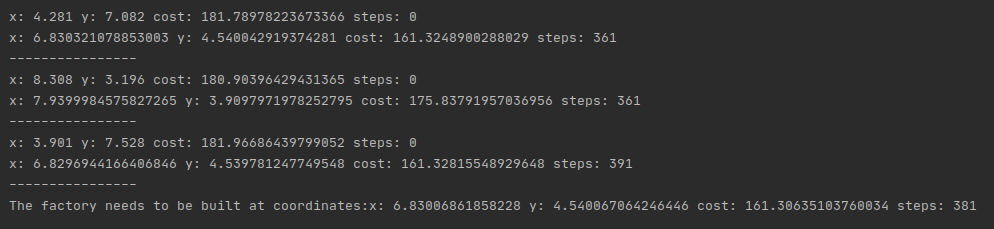

# FactoryLocation
Finding the best location for a factory using an evolutionary algorithm (1+1) based on the location of resources

## Table of contents
* [General info](#general-info)
* [Screenshots](#screenshots)
* [Technologies](#technologies)
* [Setup](#setup)
* [Description](#description)

## General info
Project realised with [@ppawel11](https://github.com/ppawel11) for the subject Fundamentals of Artificial Intelligence on the Warsaw University of Technology. Our goal was to get familiar with some methods and algorithms of artificial intelligence and to use it in practise.

## Screenshots

## Technologies
* Python 3.7

## Setup
First, to generate input (txt file with data: resources locations and some data necessary to calculate cost of the transport of the resource) you need to run `input_maker` typing: `python input_maker.py NUMBER_OF_RESOURCES` or `python3 input_maker.py NUMBER_OF_RESOURCES` for Python 3 where NUMBER_OF_RESOURCES should be `int` variable. Then you can run `main.py`. 

## Description
Program can be used to calculate where a factory should be built to keep resources transportation as low as possible. It produces a lot of initial "bees" with initial location. Then using 1+1 evolutionary algorithm it produces new generations of "bees" with changed (or the same if the cost after change would be higher) location. So we can say that "bees" explore the board looking for the best location of the factory. At the end the program chooses the best "bee" with the lowest cost of transportation.
